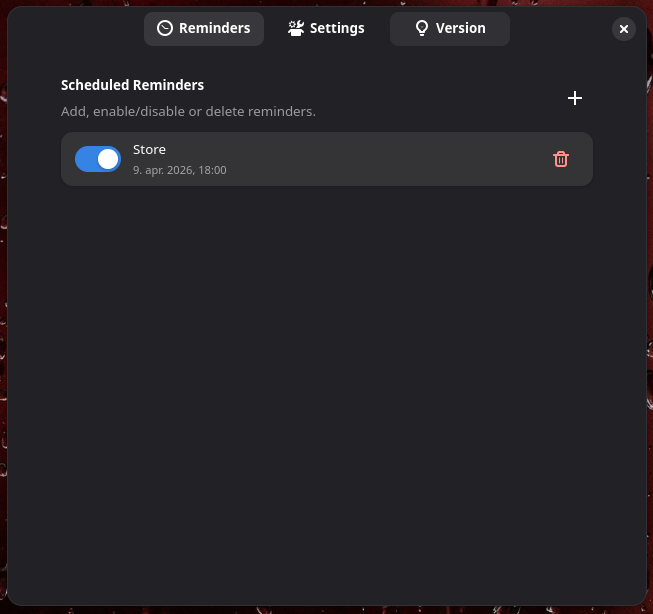
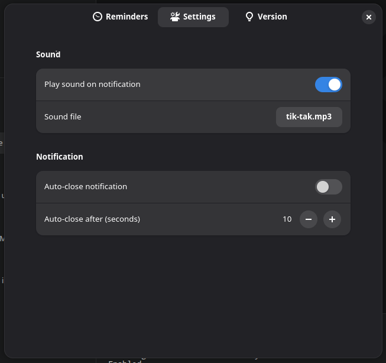

# baReminder

`baReminder` is a GNOME Shell extension for scheduling multiple reminders with date/time notifications and optional sound.

## Features

- Store reminders in JSON settings
- Schedule reminders by date and time
- Notify the user when a reminder is due
- Optional notification sound with custom file path
- Automatic reminder list refresh
- Supports GNOME Shell 45 through 52

## Screenshots





## Installation

```bash
git clone https://github.com/trinajstica/baReminder.git
cd baReminder
./install.sh
```

The installer compiles the GSettings schema and installs the extension into:

`~/.local/share/gnome-shell/extensions/baReminder@barko.generacija.si`

To enable the extension:

```bash
gnome-extensions enable baReminder@barko.generacija.si
```

If you are running GNOME on Wayland, log out and log back in after installation.

## Uninstall

```bash
./uninstall.sh
```

If the extension was enabled, it will be disabled first and then removed.

## Dependencies

- `glib-compile-schemas`
- `gnome-extensions` (optional; installer will try to enable automatically)
- `paplay` for sound playback if sound is enabled

## Configuration

Settings are stored in GSettings under `org.gnome.shell.extensions.bareminder`.

Important keys:

- `reminders-json` — JSON array of reminder objects
- `play-sound` — toggle reminder sound
- `sound-file-path` — URI of the sound file
- `auto-close` — close notification automatically
- `auto-close-seconds` — auto-close timeout in seconds

## Repository

This repo is prepared for GitHub at:

https://github.com/trinajstica/baReminder

## License

This project is licensed under the MIT License. See `LICENSE` for details.
